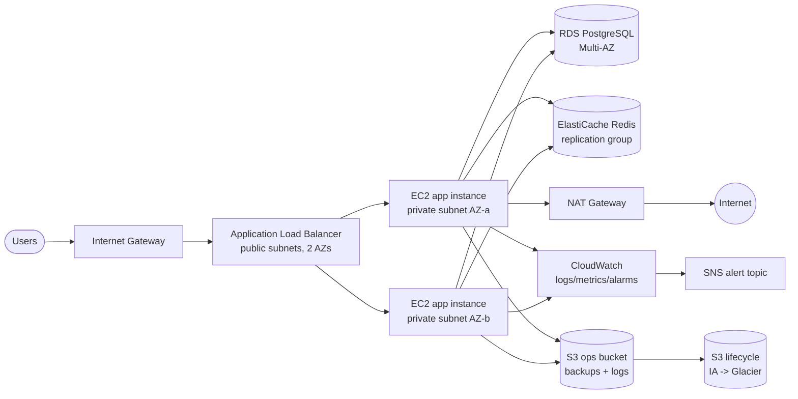
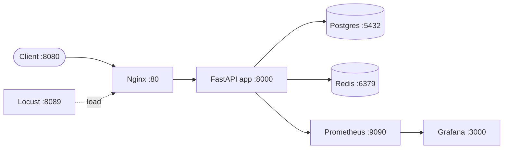
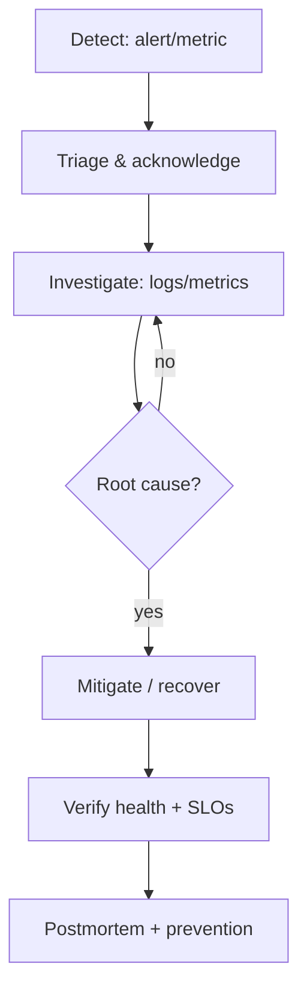

# sre-reliability-platform

A production-style **Site Reliability Engineering** portfolio project demonstrating
reliability, fault tolerance, scalability, observability, performance engineering,
Infrastructure as Code, automation and incident response on AWS.

It ships a small e-commerce-style API (FastAPI + PostgreSQL + Redis) wrapped in a
multi-AZ AWS topology defined with Terraform, with full monitoring, automation
scripts, safe local incident simulations and SLO/SLI/error-budget documentation.

> Suitable for sharing with recruiters and discussing during an SRE, Cloud
> Engineer or DevOps Engineer interview.

---

## Project overview

| Area | What this project demonstrates |
| --- | --- |
| Reliability | Multi-AZ app, RDS Multi-AZ failover, Redis failover, retry/timeout, graceful shutdown, Redis fallback to degraded DB-only mode |
| Scalability | ALB + Auto Scaling Group with CPU target-tracking and ALB request-count scaling, rolling instance refresh |
| Observability | Prometheus + Grafana locally, CloudWatch dashboards/alarms + SNS in AWS, structured JSON logs, request IDs, Prometheus metrics |
| Performance | Redis caching, DB indexes, connection pooling, Nginx gzip + cache headers, pagination, Locust load testing |
| IaC | Modular Terraform (networking, security, compute, database, cache, storage, monitoring) with dev/prod environments |
| Automation | Bash scripts for up/down/validate/terraform ops/backup/restore/health/logs/load-test/incidents/recovery |
| Incident response | 6 documented local incident simulations with runbooks; AWS actions require explicit confirmation |
| CI/CD | GitHub Actions: lint, test, tf fmt/validate, Docker build/scan, security scans |

## Business problem

A small online store needs an API to list and view products. The business
requires **high availability, low latency, fast recovery from failures, and
cost-effective scaling**. This project shows how an SRE would design, instrument,
automate and operate such a service end to end.

## Technology stack

AWS · Terraform · Docker / Docker Compose · Python FastAPI · PostgreSQL · Redis ·
Prometheus · Grafana · CloudWatch · GitHub Actions · Nginx · Locust · Bash/Python

## Architecture

### AWS architecture



### Local Docker architecture



See [`docs/ARCHITECTURE.md`](docs/ARCHITECTURE.md) for the full design.

## Reliability design

- **Multi-AZ**: app across 2+ AZs; RDS Multi-AZ; Redis replication group with
  automatic failover (prod).
- **Health checks**: ALB `/health` (liveness) and `/ready` (readiness) probes;
  ASG ELB health checks replace unhealthy instances.
- **Retry & timeout**: DB retries with backoff and bounded connect timeout;
  Redis bounded socket timeouts with retries.
- **Graceful shutdown**: SIGTERM/SIGINT handlers drain in-flight requests with a
  configurable timeout.
- **Redis fallback**: when Redis is unavailable the app serves from Postgres in
  degraded mode — no user-visible 5xx.
- **Backups**: RDS automated backups + manual `pg_dump` to S3 with lifecycle to
  Glacier; final snapshots on delete (prod).

## Fault-tolerance design

- No single AZ is a hard dependency for serving traffic (prod uses 3 AZs).
- Cache and database are separate failure domains; the app degrades gracefully
  when the cache fails.
- ASG automatically replaces failed instances; ALB stops routing to unhealthy
  targets.
- Deletion protection + final snapshots prevent accidental data loss (prod).

## Scalability design

- ALB distributes traffic; target-tracking autoscaling on average CPU
  (target ~55–65%).
- Optional ALB request-count-per-target scaling in prod.
- Rolling instance refresh with min-healthy 50%.
- Horizontal scaling stateless app; stateful layers (DB/Redis) scale vertically
  + via read replicas/failover.

## Monitoring and alerts

- **Metrics**: request count, status codes, error rate, latency histograms
  (P50/P95/P99), DB/Redis availability gauges, cache hit/miss, in-flight
  requests.
- **Local**: Prometheus scrape + alert rules + Grafana dashboard provisioning.
- **AWS**: CloudWatch dashboard + alarms (CPU, unhealthy targets, 5xx rate,
  latency, RDS storage/CPU/connections, Redis CPU/memory) → SNS.
- **Logs**: structured JSON with request correlation IDs.

See [`docs/MONITORING.md`](docs/MONITORING.md).

## Performance optimization

- Redis caching of product list/detail responses (TTL configurable).
- Database indexes on `category` and `name`; connection pooling.
- Nginx gzip compression + `Cache-Control` headers for product endpoints.
- Pagination with bounded page sizes.
- Configurable worker count; Locust load testing with a report template.

See [`docs/PERFORMANCE_TESTING.md`](docs/PERFORMANCE_TESTING.md).

## Infrastructure as Code

Modular Terraform under `terraform/`:

```
bootstrap/        # state bucket, lock table, GitHub OIDC role
modules/          # networking, security, compute, database, cache, storage, monitoring
environments/     # dev (cost-optimised) and prod (availability-optimised)
```

See [`docs/DEPLOYMENT.md`](docs/DEPLOYMENT.md).

## Automation

`make <target>` or `bash scripts/<script>.sh`. See [scripts/README.md](scripts/README.md)
and the `Makefile`.

## Incident response

Six safe local simulations with full runbooks in
[`docs/INCIDENT_RESPONSE.md`](docs/INCIDENT_RESPONSE.md) and
[`incidents/INCIDENT_CATALOG.md`](incidents/INCIDENT_CATALOG.md). AWS incident
actions require an explicit `--confirm-aws` flag.



## SLOs, SLIs and error budgets

| SLI | SLO | Target |
| --- | --- | --- |
| Availability | Monthly uptime | 99.9% |
| Request latency | Requests < 500ms | 99% |
| HTTP 5xx error rate | 5xx / all | < 1% |

With a 99.9% availability SLO over a 30-day month (43,200 min), the **error
budget is ~43.2 minutes** of downtime. Burn-rate and multi-window alerts are
documented in [`docs/SLO_SLI_ERROR_BUDGET.md`](docs/SLO_SLI_ERROR_BUDGET.md).

> All numbers in the docs are **SLO targets / worked examples**, not measured
> production results. Performance and reliability results require actual test
> runs and are clearly marked as such.

## Local setup

Prerequisites: Docker + Docker Compose, optionally Python 3.12 and Terraform.

```bash
git clone <repo-url>
cd sre-reliability-platform
cp .env.example .env          # optional; compose has defaults
make up                       # start app + pg + redis + nginx + prometheus + grafana
curl http://localhost:8080/health
# Grafana: http://localhost:3000  (admin/admin)
# Prometheus: http://localhost:9090
make test                     # run unit tests (requires python)
make down                     # stop (volumes preserved)
```

## AWS deployment steps

> This provisions billable AWS resources. Review
> [`docs/COST_ESTIMATION.md`](docs/COST_ESTIMATION.md) first.

1. Run `terraform/bootstrap` once per account/region (state bucket, lock table,
   GitHub OIDC role) using admin credentials, then remove those credentials.
2. Push the image to ECR (or build on EC2 via user-data).
3. Configure backend + tfvars for the target environment
   (`terraform/environments/dev|prod`).
4. Provide `TF_VAR_redis_auth_token` from Secrets Manager.
5. `terraform init -backend-config=backend.hcl && terraform validate && terraform plan -out=tfplan && terraform apply tfplan`
6. Verify the ALB DNS health endpoint.
7. CI/CD runs **validation and security scans only** (no AWS deployment workflow, since no AWS account is required for the portfolio). AWS deployment is performed manually with the Terraform CLI above; the GitHub OIDC role from `terraform/bootstrap` is available if you later wire a deployment pipeline.

## Testing

- **Unit tests** (`app/tests/`): hermetic, no external services (in-memory
  SQLite + fake Redis). `cd app && pytest -q`.
- **Load testing**: `make loadtest` (Locust, via the `loadtest` compose profile).
- **Incident simulations**: `bash scripts/incident-sim.sh <scenario>`.

## Security considerations

See [`docs/SECURITY.md`](docs/SECURITY.md) and [SECURITY.md](SECURITY.md).

- No real credentials in the repo; `.env`, state and keys are git-ignored.
- GitHub OIDC for AWS (no long-lived keys).
- Secret/dependency/container/Terraform scanning in CI.
- Least-privilege IAM + security groups; IMDSv2; encrypted EBS/S3/RDS/Redis.

## Estimated AWS cost

A dev-like deployment (2× t3.small, db.t3.medium Multi-AZ, 1× cache.t3.micro,
ALB, NAT, S3) is roughly **USD $90–$160/month** with light traffic; prod (3×
t3.medium, db.r6g.large Multi-AZ, 2× cache.r6g.large, 3 NAT gateways) is
roughly **USD $600–$900/month**. These are planning estimates, not a quote —
see [`docs/COST_ESTIMATION.md`](docs/COST_ESTIMATION.md) and always check the
AWS pricing calculator.

## Cleanup steps

```bash
# Local
make down
docker compose down -v        # also remove volumes (deletes local DB data)

# AWS
cd terraform/environments/dev
terraform destroy             # dev (deletion protection off)
# prod: set deletion_protection=false first, apply, then destroy
# Empty/delete the bootstrap state bucket + DynamoDB table if no longer needed
```

## Repository structure

```
sre-reliability-platform/
├── app/                  # FastAPI app, Dockerfile, requirements, tests
├── terraform/            # bootstrap + modules + dev/prod environments
├── monitoring/           # prometheus, grafana, cloudwatch
├── nginx/                # nginx.conf
├── load-testing/         # locustfile.py + results/
├── scripts/              # automation scripts
├── incidents/            # incident catalog + runbooks
├── docs/                 # architecture & operations guides
├── .github/              # workflows, issue/PR templates
├── docker-compose.yml
├── Makefile
├── .env.example
└── README.md
```

## Screenshots

> Add screenshots of Grafana dashboards, Prometheus alerts, CloudWatch
> dashboards, and load-test results after running the stack. Place them in
> `docs/screenshots/` and link them here.

- [ ] Grafana overview dashboard
- [ ] Prometheus alert firing
- [ ] CloudWatch dashboard
- [ ] Locust load-test results

## Future improvements

- Prometheus remote write to CloudWatch / Grafana Cloud for prod.
- Blue/green or canary deployments via CodeDeploy/ALB weighting.
- Terraform drift detection and automated `plan` on PRs with cost estimation
  (Infracost).
- Read replicas + connection pooling via RDS Proxy.
- Chaos automation (e.g., Chaos Mesh / AWS FIS) for prod incident drills.
- OpenTelemetry traces alongside metrics and logs.


