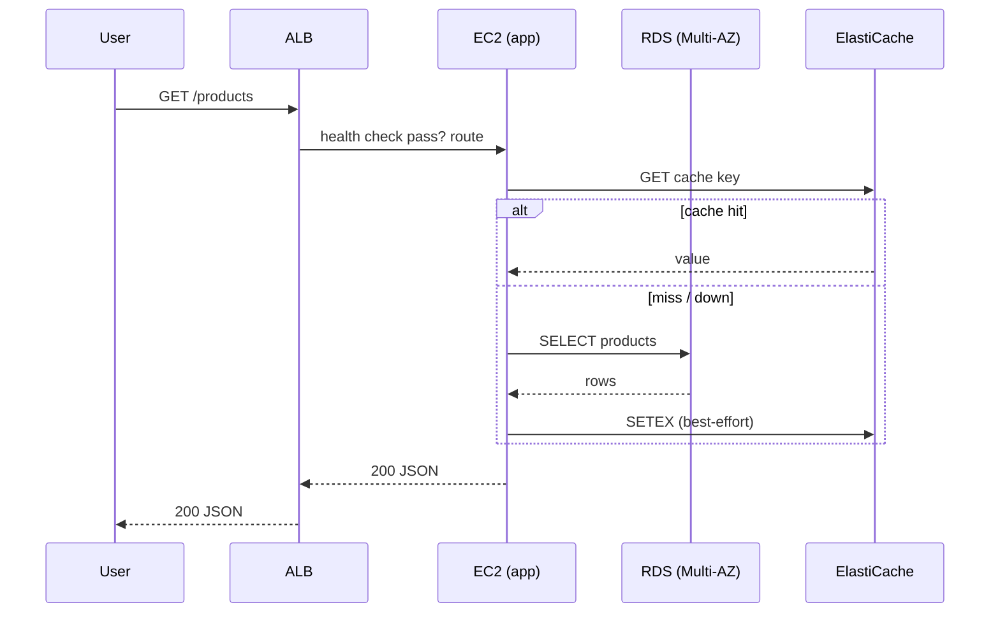

# Architecture

## Design goals

1. **Availability** — serve traffic across multiple AZs with automated failover.
2. **Resilience** — degrade gracefully when a dependency fails.
3. **Observability** — every request is measured, logged and correlated.
4. **Cost control** — dev defaults minimise spend; prod defaults maximise uptime.
5. **Safety** — least privilege, encryption everywhere, no long-lived keys.

## Components

### Application (FastAPI)

Stateless Python service exposing `/products`, `/products/{id}`, `/health`,
`/ready`, `/metrics`. Runs behind Nginx locally and behind an ALB on AWS.

- Request correlation via `X-Request-ID` (generated if absent).
- Prometheus metrics for every request.
- Redis cache with graceful fallback to Postgres.
- Configurable timeouts, retries and worker count.
- Incident-injection flags (`INJECT_LATENCY_MS`, `INJECT_FAILURE_RATE`,
  `HIGH_CPU_LOAD`) for safe simulations.

### Data layer

- **PostgreSQL**: source of truth. Multi-AZ in AWS; in-memory/ephemeral locally.
- **Redis**: cache only. Outage does not cause 5xx — app falls back to the DB.

### Edge

- **Local**: Nginx (gzip, cache headers, reverse proxy, request-id forwarding).
- **AWS**: Application Load Balancer (health checks, cross-AZ routing, optional
  TLS via ACM).

### Compute

- **AWS**: EC2 launch template + Auto Scaling Group across private subnets in 2+
  AZs. CPU target-tracking scaling + optional ALB request-count scaling. Rolling
  instance refresh. IMDSv2 + encrypted EBS.

### Observability

- **Local**: Prometheus → scrape `/metrics`; Grafana dashboard provisioning.
- **AWS**: CloudWatch logs/metrics/alarms + dashboard; SNS alerts. App logs are
  JSON so CloudWatch Logs Insights can parse `request_id`.

## Traffic flow (AWS)

## Failure domains

| Failure | Impact | Mitigation |
| --- | --- | --- |
| Single EC2 dies | Traffic shifts to healthy targets | ASG replacement + ALB health checks |
| AZ failure | Other AZs serve | Multi-AZ app + RDS Multi-AZ |
| Redis down | Degraded (DB-only), no 5xx | Cache fallback + alert |
| DB down | 5xx until recovered (hard dep) | RDS Multi-AZ failover, retries, readiness gate |
| AZ-wide NAT failure | Private egress affected | NAT per AZ in prod |

## Decisions and trade-offs

- Cache is **not** a source of truth → simpler correctness, accept higher DB load
  on cache miss.
- DB is a hard dependency (strong consistency for product data); cache outage is
  soft.
- Dev uses a single NAT gateway to save cost; prod uses one per AZ for HA.
