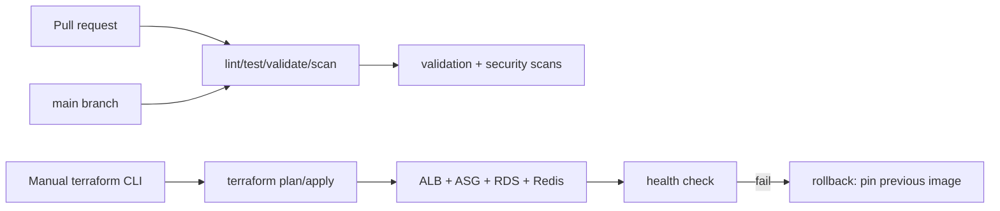

# Deployment

## Local

```bash
make up                       # docker compose up -d
make test                     # pytest (requires python)
make loadtest                 # Locust (loadtest profile)
make down
```

## AWS (Terraform)

### 1. Bootstrap (once per account/region)

```bash
cd terraform/bootstrap
terraform init
# Provide a globally unique state bucket name and your GitHub repo:
terraform apply \
  -var="state_bucket_name=YOUR-ACCOUNT-sre-platform-tfstate" \
  -var="github_repo=RIT-MESH/sre-reliability-platform"
```

Outputs: state bucket, lock table, `github_actions_role_arn`, KMS key ARN.

### 2. Build & push the app image to ECR

```bash
aws ecr create-repository --repository-name sre-platform
docker build -t sre-platform ./app
docker tag sre-platform:latest <acct>.dkr.ecr.<region>.amazonaws.com/sre-platform:latest
aws ecr get-login-password | docker login --username AWS --password-stdin <acct>.dkr.ecr.<region>.amazonaws.com
docker push <acct>.dkr.ecr.<region>.amazonaws.com/sre-platform:latest
```

### 3. Configure an environment

```bash
cd terraform/environments/dev
cp terraform.tfvars.example terraform.tfvars     # edit ami_id, ecr_image, alert_email
cp backend.hcl.example backend.hcl              # edit state bucket
export TF_VAR_redis_auth_token="$(aws secretsmanager get-secret-value --secret-id sre-dev/redis/auth --query SecretString --output text)"
terraform init -backend-config=backend.hcl
terraform validate
terraform plan -out=tfplan
terraform apply tfplan
```

### 4. Verify

```bash
terraform output -raw alb_dns_name   # e.g. sre-dev-alb-xxxx.us-east-1.elb.amazonaws.com
curl http://<alb>/health
curl http://<alb>/ready
curl http://<alb>/metrics
```

### 5. CI/CD (GitHub Actions)

The repository's GitHub Actions run **validation and security scans only** —
there is intentionally **no AWS deployment workflow**, because deploying
requires an AWS account and billable resources and is not needed for the
portfolio. The workflows that run automatically on push/PR:

- Python lint (ruff) + unit tests (pytest)
- Terraform `fmt` + `validate` + tfsec
- Docker image build + Trivy scan (fails on HIGH/CRITICAL)
- Secret scanning (gitleaks) + dependency scanning (pip-audit)

AWS deployment is performed manually with the Terraform CLI (steps 1–4 above).
If you later want CI-driven deployment, `terraform/bootstrap` already creates a
GitHub OIDC IAM role (`github_actions_role_arn` output) so you can add a
`workflow_dispatch` deploy workflow that assumes it with
`permissions: id-token: write` — no long-lived keys.



## Rolling deployment & rollback (manual)

- New image tag → update `TF_VAR_ecr_image` → re-run `terraform apply`.
- ASG rolling instance refresh replaces instances with min-healthy 50%.
- If `/health` fails after apply: pin `TF_VAR_ecr_image` to the last good tag
  and re-apply (rollback). Infra regressions: targeted `terraform state`/apply.

## Cleanup

```bash
cd terraform/environments/dev && terraform destroy
# prod: set deletion_protection=false, apply, then destroy
# then remove bootstrap state bucket + DynamoDB table
```
