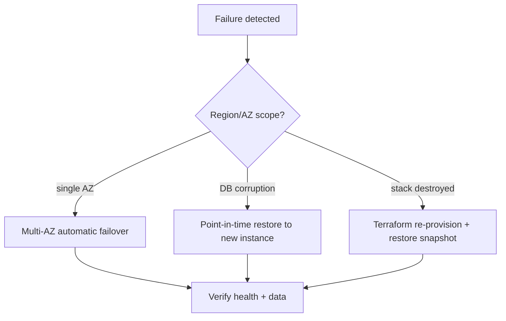

# Disaster recovery

## RTO / RPO targets

| Target | Goal | Mechanism |
| --- | --- | --- |
| RPO (data loss) | ≤ 5 min | RDS automated backups (point-in-time recovery) + manual backups |
| RTO (recovery time) | ≤ 30 min | Multi-AZ failover + ASG replacement + IaC re-provision |

## Backup strategy

- **RDS automated backups**: configurable retention (dev 1d, prod 30d) with
  point-in-time recovery (typically to within 5 minutes).
- **RDS snapshots**: automated daily + final snapshot on delete (prod).
- **Manual backups**: `scripts/db-backup.sh` → `pg_dump` gzip → optional S3
  upload with lifecycle (IA → Glacier → expire at 365d).
- **Terraform state**: versioned, encrypted S3 bucket + DynamoDB lock (bootstrap).

## Restore procedures



### Point-in-time restore (AWS)

```bash
aws rds restore-db-instance-to-point-in-time \
  --source-db-instance-identifier sre-prod-pg \
  --target-db-instance-identifier sre-prod-pg-restored \
  --restore-time 2026-07-16T03:00:00Z \
  --db-subnet-group-name sre-prod-db-subnet-group \
  --vpc-security-group-ids sg-xxxx
# Swap app config to the restored endpoint, verify, then rename/cleanup.
```

### Restore from manual dump (local)

```bash
bash scripts/db-restore.sh backups/shop_YYYYMMDDTHHMMSSZ.sql.gz
curl http://localhost:8080/products?page=1   # verify
```

## Region failure (advanced, documented)

This project is single-region for cost. A multi-region DR design would:
- Replicate RDS cross-region (read replica with promote).
- Multi-region ALB / Route 53 health-checked routing.
- Replicate S3 cross-region (CRR).
- Maintain a second Terraform environment in the DR region.

These are documented as future improvements, not implemented.

## Testing DR

- Periodically restore a backup into a disposable instance and verify row counts.
- Practice an RDS failover reboot in a non-prod environment.
- Verify Terraform can re-provision from scratch into a fresh VPC.
