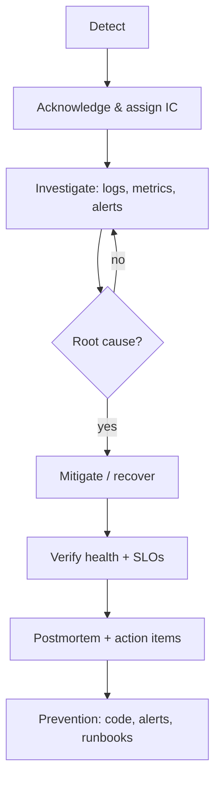

# Incident response

## Lifecycle

## Roles

- **Incident Commander (IC)**: coordinates, owns timeline, decides mitigation.
- **Responder(s)**: investigate and execute recovery.
- **Communicator**: updates stakeholders/status page.

## Severity

| Severity | Meaning | Target response |
| --- | --- | --- |
| SEV1 | Full outage / data impact | page immediately, IC engaged |
| SEV2 | Major degradation / SLO burn | page, work immediately |
| SEV3 | Minor / limited impact | ticket, work in business hours |
| SEV4 | Cosmetic / non-urgent | backlog |

## Safe simulations

See [`../incidents/INCIDENT_CATALOG.md`](../incidents/INCIDENT_CATALOG.md) for
six local incident simulations (app crash, Redis outage, DB outage, latency,
5xx spike, high CPU) with symptoms, expected alerts, investigation commands,
root cause, recovery, verification and prevention.

Trigger: `bash scripts/incident-sim.sh <scenario>`.
Recover: `bash scripts/service-recovery.sh [app|redis|postgres|all]`.

AWS incident actions require the explicit `--confirm-aws` flag and never run
automatically.

## Postmortem template

- **Summary** (one paragraph)
- **Impact** (users/SLO budget affected, duration)
- **Timeline** (UTC timestamps)
- **Root cause**
- **Contributing factors**
- **What went well / badly**
- **Action items** (with owners and due dates)
- **Detection** (alerted vs discovered how)
