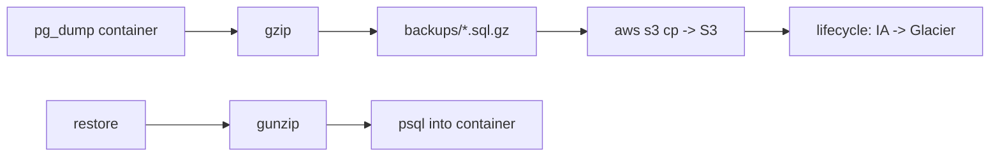

# Runbook

Operational runbooks for the sre-reliability-platform. Commands target the
**local Docker Compose** stack unless noted. AWS commands are prefixed and
require authentication.

## Check service health

```bash
curl -s http://localhost:8080/health | jq .
curl -s http://localhost:8080/ready  | jq .
docker compose ps
```

## Inspect metrics & alerts

```bash
# Prometheus
open http://localhost:9090
curl -s http://localhost:9090/api/v1/alerts | jq '.data.alerts[] | .labels.alertname'
# Grafana
open http://localhost:3000   # admin/admin
```

## Collect logs

```bash
bash scripts/collect-logs.sh           # -> collected-logs/<ts>/
docker compose logs --tail=200 app
```

## Recover a service

```bash
bash scripts/service-recovery.sh app      # or redis | postgres | all
```

## Database backup & restore



```bash
bash scripts/db-backup.sh                       # local backup
bash scripts/db-backup.sh --s3 s3://bucket/path # backup + upload
bash scripts/db-restore.sh backups/shop_*.sql.gz # restore
```

## Run a load test

```bash
bash scripts/load-test.sh 200 20 2m
```

## Trigger / recover an incident

```bash
bash scripts/incident-sim.sh redis-outage
bash scripts/service-recovery.sh redis
```

## AWS: scale out manually

```bash
aws autoscaling set-desired-capacity \
  --auto-scaling-group-name sre-prod-asg --desired-capacity 6
```

## AWS: failover RDS (reboot with failover)

```bash
aws rds reboot-db-instance --db-instance-identifier sre-prod-pg --force-failover
```

> Only run AWS actions with explicit intent and confirmation.
